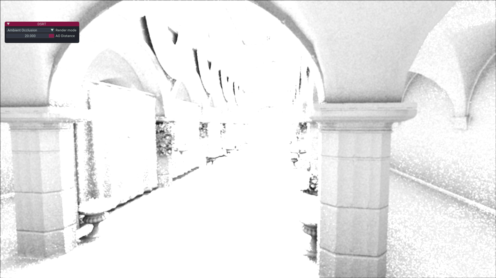

# DSRT

Deferred shading with ray traced shadows and ambient occlusion.
This project uses the Mandrill Vulkan framework to demonstrate how to implement deferred shading and combine it with the ray tracing pipeline.

### Resolve

	

### Shadow from direct lighting

	

### Ambient occlusion

	

## Build

To build and compile, follow the [Mandrill build instructions](https://rikardolajos.github.io/Mandrill/index.html#autotoc_md2) but replace the Mandrill repository URL with this repository URL when cloning.
